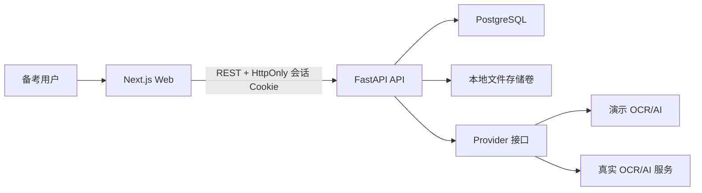

# AI 公考错题诊断系统设计规格

- 日期：2026-07-10
- 状态：已获用户批准，待书面规格复核
- 产品范围：PRD 中的 P0 MVP
- 选定视觉方向：方案 1「今日复习驾驶舱」
- 视觉参考：[Dashboard 视觉稿](../../design/ai-exam-diagnosis-dashboard-selected.png)

## 1. 产品目标

系统面向国考、公务员考试和事业编备考用户，把分散的错题转化为可持续复盘闭环：

> 上传或手动录题 → OCR 修正 → 保存 → AI 分析 → 分类归档 → 每日复习 → 数据反馈

第一版既要能作为个人长期使用的工具，也要能在没有外部 API 密钥时完整演示。它不是题库平台，不在 MVP 中加入付费、机构后台、同类题推荐、复杂多题自动拆分、忘记密码或多人协作。

## 2. 已确认的关键决策

### 2.1 实现路线

采用 PRD 推荐的前后端分离路线：

- Web：Next.js、React、TypeScript、Tailwind CSS。
- API：FastAPI、SQLAlchemy、Alembic。
- 数据库：PostgreSQL。
- 本地编排：Docker Compose。
- 文件：第一版本地持久化卷，接口边界允许后续迁移到对象存储。
- 外部能力：真实 AI/OCR Provider 与确定性演示 Provider 共用统一接口。

曾考虑但不采用的路线：

1. Next.js 全栈单体。初期文件更少，但偏离 PRD，Python OCR 生态与后续任务处理扩展也较弱。
2. 纯前端高保真原型。交付最快，但无法证明用户隔离、真实数据闭环和 Provider 集成，不满足“可运行 Web SaaS Demo”。

### 2.2 Provider 策略

环境变量 `PROVIDER_MODE` 支持：

- `auto`：存在真实服务密钥时调用真实 Provider，否则使用演示 Provider；作为默认值。
- `live`：强制真实 Provider，缺少配置时启动检查失败并给出明确错误。
- `demo`：强制演示 Provider，保证离线展示稳定。

真实 Provider 第一版使用 OpenAI Responses API，同时承载图片文字识别与结构化错题分析；`OPENAI_API_KEY` 和具体模型名通过环境变量配置，业务代码不绑定固定模型。演示 Provider 不冒充真实 AI：界面显示“演示模式”，OCR 返回固定但结构完整的示例题，分析结果根据题目模块、答案和解析确定性生成，便于端到端测试。

## 3. 信息架构与页面

### 3.1 公共页面

1. `/login`：邮箱、密码、登录、前往注册。
2. `/register`：邮箱、密码、确认密码、注册并进入系统。

登录用户访问登录或注册页时跳转首页；未登录用户访问业务页时跳转登录页。

### 3.2 登录后页面

左侧导航固定包含：

1. 首页
2. 错题录入
3. 错题库
4. 今日复习
5. 数据统计

对应页面：

- `/dashboard`：每日学习驾驶舱。
- `/questions/new`：图片 OCR 或手动录入。
- `/questions`：错题表格、筛选与批量操作。
- `/questions/[id]`：错题详情、编辑、分析、笔记和复习记录。
- `/review`：今日复习序列。
- `/analytics`：基础诊断统计。

## 4. 视觉与交互设计

### 4.1 视觉语言

沿用所选视觉稿的专业、清晰、智能学习感：

- 浅色主背景与白色内容面，深海军蓝正文。
- 靛蓝到蓝紫作为主强调色，薄荷绿表示成功，琥珀色表示复习中，珊瑚红表示未掌握或错误。
- 正文以 14–16px 为基线，保持明显层级和充足留白。
- 圆角上限约 12px；优先用间距、排版和分隔线组织信息，少用阴影。
- 使用统一线性图标库；不使用手绘 SVG、Emoji 或装饰性 3D 素材。

### 4.2 Dashboard

Dashboard 不做功能卡片墙，按优先级展示：

1. 顶部问候、日期和用户菜单。
2. 主区域“今日复习”：完成数、总数、进度、预计时间、当前题目摘要和“继续复习”主按钮。
3. 两个辅助入口：“录入错题”和“AI 学习建议”。
4. 最近错题回顾表格，使用行分隔线展示模块、知识点、状态和下一步操作。

空状态时，“今日复习”解释生成规则并引导先录入错题；已完成状态展示完成反馈和查看统计入口。

### 4.3 错题录入

- 图片模式采用左侧原图预览、右侧可编辑表单。
- 手动模式隐藏图片区，表单居中并保留相同字段。
- 上传后先显示预览，再手动触发 OCR；识别结果只填充表单，不自动保存。
- 必填字段为考试类型、考试模块、题干、我的答案和正确答案。
- 选项支持 A–D 默认行，并允许增加或删除。
- 保存成功后进入详情页，用户再手动触发 AI 分析。
- 单图大小、文件类型和识别失败都在原位置给出可恢复反馈。

### 4.4 错题库与详情

错题库使用表格，支持模块、知识点、错因、掌握状态、创建时间和分析状态筛选。筛选条件反映在 URL 查询参数中，刷新后保持。多选后可批量删除或批量修改掌握状态；删除必须二次确认。

详情页按“题目—答案—原解析—AI 诊断—个人笔记—复习记录”排列。编辑保存和 AI 重新分析分开，避免未确认的文本被直接送入模型。用户可以修改知识点、错因和掌握状态。

### 4.5 今日复习

默认每日 20 题，可切换 10、20、30 或 50。排序优先级为：

1. 未掌握
2. 复习中
3. 最近新增
4. 薄弱知识点

复习页一次聚焦一道题，先显示题目和用户答案，再由用户展开正确答案、原解析和 AI 分析。完成时可选择“已掌握”“复习中”或“仍未掌握”，并添加本次复习笔记。进度在当前会话和服务端记录中同步更新。

### 4.6 数据统计

统计页提供：

- 总错题数。
- 五大模块错题占比。
- 知识点错题排行。
- 错误原因分布。
- 掌握状态分布。
- 最近 7 天和 30 天录入趋势。
- 基于当前统计生成的 AI 薄弱点总结。

图表与表格必须有文字标签和可读数值，颜色不是唯一的信息表达方式。

### 4.7 响应式与可访问性

- 桌面端为主，宽度不足时侧边栏折叠为抽屉。
- 录入页在窄屏改为“图片在上、表单在下”。
- 表格在窄屏变为重点字段列表，不依赖横向拖动完成核心操作。
- 所有输入有标签，按钮可键盘访问，焦点状态清晰，关键文字与背景满足 WCAG AA 对比度目标。

## 5. 系统架构

前端不直接访问数据库、文件目录或第三方 AI。所有用户数据访问、上传校验、Provider 调用和统计聚合均由 API 执行。

## 6. 领域模型

### 6.1 User

- `id`
- `email`，唯一且规范化
- `password_hash`
- `created_at`、`updated_at`

### 6.2 Question

- `id`、`user_id`
- `exam_type`：国考、省考、事业编、其他
- `module`：言语理解、数量关系、判断推理、资料分析、常识判断
- `stem`
- `options`：JSON 数组，每项含 `label` 与 `content`
- `user_answer`、`correct_answer`
- `original_explanation`
- `source`、`notes`
- `image_path`
- `ocr_raw_text`
- `knowledge_points`：JSON 字符串数组
- `error_reason`：粗心、不会、理解错、计算错、时间不够
- `mastery_status`：未掌握、复习中、已掌握
- `analysis_status`：未分析、分析中、已完成、失败
- `tags`：预留 JSON 数组，第一版不开放自由标签 UI
- `created_at`、`updated_at`

### 6.3 Analysis

- `id`、`question_id`、`user_id`
- `cause_analysis`
- `knowledge_points`
- `correct_approach`
- `study_advice`
- `suggested_error_reason`
- `raw_response`：原始结构化 JSON
- `provider_name`、`model_name`、`is_demo`
- `created_at`

每次重新分析新增一条记录，Question 指向当前最新分析，保留历史以便审计。

### 6.4 ReviewRecord

- `id`、`question_id`、`user_id`
- `result_status`
- `review_note`
- `reviewed_at`

### 6.5 UserSettings

- `user_id`
- `daily_review_limit`：10、20、30 或 50，默认 20

## 7. API 边界

统一前缀为 `/api/v1`。

### 7.1 认证

- `POST /auth/register`
- `POST /auth/login`
- `POST /auth/logout`
- `GET /auth/me`

### 7.2 错题与上传

- `POST /uploads/questions`：上传并返回临时文件标识。
- `POST /ocr`：对已上传图片执行 OCR，返回可编辑结构。
- `POST /questions`
- `GET /questions`
- `GET /questions/{id}`
- `PATCH /questions/{id}`
- `DELETE /questions/{id}`
- `POST /questions/bulk-status`
- `POST /questions/bulk-delete`
- `POST /questions/{id}/analyze`

### 7.3 复习与统计

- `GET /reviews/today`
- `POST /reviews/{question_id}`
- `GET /analytics/summary`
- `GET /dashboard`

列表接口分页；筛选与排序由服务端执行。所有按 ID 访问的接口同时限定当前用户，跨用户 ID 对外统一表现为不存在。

## 8. 核心数据流

### 8.1 图片录题

1. Web 校验扩展名和大小并上传。
2. API 再次校验 MIME、大小和图片可解码性，以随机文件名保存。
3. 用户点击 OCR，API 选择 Provider 并返回结构化字段及原始文本。
4. Web 把结果填入可编辑表单。
5. 用户修正并保存，API 创建归属当前用户的 Question。
6. 用户在详情页手动触发分析。

### 8.2 AI 分析

1. API 校验题目归属和必需字段。
2. 将题干、选项、用户答案、正确答案、原解析和 OCR 文本传给 Provider。
3. Provider 返回经服务端 Schema 验证的结构化结果。
4. API 保存 Analysis，并把推荐知识点、错因和分析状态同步到 Question。
5. 失败时保存失败状态和可公开的错误码，不保存密钥或敏感请求头；用户可重试。

### 8.3 今日复习

1. API 读取用户每日数量设置。
2. 候选集包含所有未掌握、复习中的题目，以及最近 7 天新录入且当日尚未复习的题目。
3. 排序分数依次叠加：未掌握 100、复习中 60、最近 7 天新增 30、属于当前前三薄弱知识点 20；同分时按创建时间倒序、ID 倒序，保证结果稳定。
4. 当天已经提交复习结果的题目保留在完成进度中，但不再次作为待复习题出现。
5. 用户提交结果后新增 ReviewRecord，并更新 Question 掌握状态。

## 9. 认证、安全与隐私

- 密码使用业界标准自适应哈希算法保存，不记录明文。
- 登录状态使用有效期 7 天的签名访问令牌，存放在 `HttpOnly`、`SameSite=Lax` Cookie 中；生产环境启用 `Secure`。退出登录清除 Cookie，第一版不引入刷新令牌。
- 写操作校验允许的 Origin，并限制跨域来源。
- 用户输入在服务端做长度、枚举和结构验证。
- 上传仅接受 JPEG、PNG、WebP；限制单文件大小并验证实际图片内容。
- 文件路径不由用户提供，下载图片也必须检查所属用户。
- API 日志不输出密码、Cookie、密钥或完整模型请求。
- 认证和 Provider 接口具有基础速率限制边界，具体阈值在实施计划中定义。

## 10. 错误处理

API 统一返回稳定错误结构：`code`、`message`、`field_errors` 和 `request_id`。

- 表单错误：定位到字段，不清空用户已输入内容。
- 认证过期：清除本地用户状态并跳转登录，保留安全的返回路径。
- 上传失败：保留预览和表单，允许重新上传。
- OCR/AI 超时或服务失败：显示失败原因类别和重试按钮，不自动重复计费调用。
- 数据为空：解释原因并给出录题入口，不展示零值图表墙。
- 网络断开：页面保留未提交内容，恢复后由用户显式重试。

## 11. 测试策略

### 11.1 后端

- 注册、登录、退出、会话保持与重复邮箱。
- 每个 Question、Analysis、ReviewRecord 和统计接口的用户隔离。
- 上传类型、大小、损坏图片和随机文件名。
- OCR/AI 演示 Provider 的确定性输出。
- 真实 Provider 的协议适配使用 Mock HTTP 验证，不在常规测试中消耗真实额度。
- 今日复习数量、状态优先级和稳定排序。
- 统计聚合与日期边界。

### 11.2 前端

- 登录注册表单与错误反馈。
- OCR 回填后可编辑且不会自动保存。
- 筛选 URL 状态、批量操作与删除确认。
- 详情编辑、分析失败重试和掌握状态修改。
- 今日复习展开答案、提交结果和进度更新。
- 图表文字标签、空状态、键盘焦点和关键响应式断点。

### 11.3 端到端

Chrome 验收覆盖：

1. 注册并保持登录。
2. 上传一张图片，执行演示 OCR 并人工修改。
3. 保存错题并触发演示 AI 分析。
4. 在错题库筛选并打开详情。
5. 在今日复习中提交状态和笔记。
6. 在 Dashboard 与统计页看到一致更新。
7. 第二个用户不能读取第一个用户的错题。

## 12. 运行与配置

仓库根目录提供：

- `docker-compose.yml`：Web、API、PostgreSQL 与上传卷。
- `.env.example`：非敏感配置、`PROVIDER_MODE`、`OPENAI_API_KEY` 和模型配置说明，示例值不包含真实密钥。
- `README.md`：本地启动、演示账号/数据、真实 Provider 配置、测试与常见故障。
- 数据库迁移与可重复执行的演示数据脚本。

默认启动路径必须不要求外部密钥：`PROVIDER_MODE=auto` 在无密钥时进入演示模式。真实服务配置缺失不能阻止其他核心功能。

## 13. MVP 验收矩阵

| PRD 成功标准 | 验收证据 |
|---|---|
| 用户可以注册登录 | 认证 API 测试与 Chrome 注册登录流程 |
| 用户可以上传一张错题截图 | 上传 API 测试与录入页实测 |
| 系统可以识别图片文字 | 演示 Provider E2E；真实 Provider 协议测试 |
| 用户可以修改 OCR 结果 | 前端交互测试与 Chrome 表单实测 |
| 用户可以保存错题 | Question API 测试与详情页展示 |
| 用户可以手动触发 AI 分析 | 分析 API 测试与详情页按钮实测 |
| 返回错因、知识点和正确思路 | Analysis Schema 测试与详情渲染 |
| 错题库可以筛选 | 服务端筛选测试与 URL 状态测试 |
| 用户可以进入今日复习 | Review API 与 Chrome 复习流程 |
| 用户可以修改掌握状态 | ReviewRecord 与 Question 状态断言 |
| 用户可以查看基础统计 | 聚合测试与统计页图表实测 |
| 数据按用户隔离 | 跨用户 API 集成测试 |
| 批量删除和批量状态修改 | 批量 API 与 UI 确认流程 |
| 登录状态保持 | Cookie 会话集成测试和页面刷新实测 |

只有当自动化测试通过、Docker Compose 可启动、上述 Chrome 流程完成，并逐条获得矩阵证据，才可以宣称 MVP 完成。
