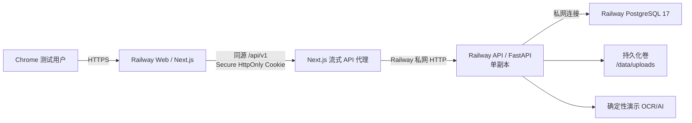

# Railway 正式测试环境部署设计规格

- 日期：2026-07-11
- 状态：方案与书面规格均已获用户批准，进入实施
- 发布方式：Railway CLI 直接上传当前已验证源码
- AI 模式：确定性演示 Provider
- 浏览器通信：Web 同源 API 代理
- 目标分支：`codex/ai-exam-system`

## 1. 目标与完成定义

为现有 AI 公考错题诊断系统创建一套与本地数据完全隔离的 Railway 正式测试环境，在不改写现有 Next.js、FastAPI、PostgreSQL 架构的前提下完成一次真实公网 HTTPS 验收。

只有同时满足下列条件才算完成：

1. Web、API 与 PostgreSQL 均在 Railway 独立运行，Web 和 API 有可访问的 HTTPS 地址；浏览器业务请求只访问 Web 同源 `/api/v1`。
2. API 使用持久化 PostgreSQL，上传文件写入挂载在 `/data/uploads` 的持久化卷。
3. API 只运行一个副本，避免本地文件卷与进程内限流在多副本间产生不一致。
4. 正式环境配置 fail-closed：强 JWT 密钥、Secure Cookie、精确 HTTPS CORS、明确的 `demo` Provider，以及非本地数据库地址。
5. Alembic 迁移在应用切流前单独执行；迁移失败时不得发布新版本。
6. 健康检查能区分进程存活与数据库/上传卷就绪状态。
7. 不运行演示账号种子，不复制或修改本地数据库、上传文件和现有 Docker 容器。
8. 使用新注册的专用测试账号走通注册、登录、图片上传、演示 OCR、字段修正、保存、演示 AI 诊断、错题库、复习、统计、退出和重新登录。
9. 重启 API 与数据库后，测试账号、错题、分析、复习记录和上传图片仍然存在。
10. 最终交付公网地址、部署版本、验证记录、已知限制和后续切换真实 AI 的安全步骤。

## 2. 方案选择

### 2.1 采用：Railway CLI 直传源码

从当前工作区根目录分别向 Web 与 API 服务执行：

- API：`railway up apps/api --path-as-root --service api`
- Web：`railway up apps/web --path-as-root --service web`

`--path-as-root` 让每个现有 Dockerfile 继续使用自己的应用目录作为构建上下文，避免改变已经通过本地验证的 `COPY` 边界。每个应用目录内新增独立的 `railway.json`，固定 Dockerfile builder、单副本、健康检查和 API 的迁移/卷要求。

该方式不依赖新增 GitHub 仓库，能发布当前已完成本地 QA 的确切源码状态，也适合本次“一次完整正式环境测试”的目标。

### 2.2 本次不采用

- GitHub 自动部署：适合长期 CI/CD，但当前 GitHub 连接中没有可用仓库，会增加仓库创建与授权步骤。
- Docker Compose 画布导入：可以快速生成服务，但部分 Compose 字段无法一一映射，关键安全与迁移配置更难审计。
- OpenAI Sites：现有应用依赖 FastAPI、PostgreSQL 和 POSIX 上传卷，迁移到 Sites 需要重写后端与存储，不属于本次部署范围。
- 浏览器直接跨 Railway Web/API 子域调用：`up.railway.app` 是公共后缀，两个服务域名属于不同站点，`SameSite=Lax` 会话 Cookie 不可靠。
- `SameSite=None`：会依赖第三方 Cookie，受浏览器隐私策略限制；本次采用 Web 同源代理。
- 自有域名：可以让 Web/API 位于同一站点，但需要额外域名和 DNS 操作，本次完整测试不要求。

## 3. 生产拓扑

### 3.1 Web 服务

- 由现有 Next.js standalone 镜像运行。
- 监听 Railway 注入的 `PORT`。
- 浏览器 API 基址固定为同源 `/api/v1`。
- Catch-all Route Handler 将所有 `/api/v1/*` 方法、请求体和必要请求头流式转发到 `API_INTERNAL_URL`，并保留状态码、响应体、`Set-Cookie` 与请求 ID；不得把私网地址暴露给浏览器。
- 代理删除客户端 `Host` 与 hop-by-hop headers，让服务端请求使用 API 私网主机名。
- 健康检查使用根页面或专用轻量端点，必须返回 HTTP 200。
- Web 不持有数据库、JWT 或第三方 Provider 密钥。

### 3.2 API 服务

- 由现有 FastAPI 镜像运行并监听 Railway 注入的 `PORT`。
- `PORT` 明确固定为 `8000`，供 Web 通过 Railway 私网稳定寻址。
- 单副本部署。
- `/health` 仅表示进程可响应，并报告当前 Provider 模式。
- `/ready` 同时验证数据库可查询和上传目录可写；任一失败时返回非 200。
- Railway 发布健康检查指向 `/ready`。
- 上传卷挂载到 `/data/uploads`；运行用户必须经过真实写入探针验证。
- 如果 Railway 的卷以 root 所有者挂载，则启动阶段只使用最小 root 权限修正卷目录所有权，随后降权到应用用户运行 Uvicorn。

### 3.3 PostgreSQL 服务

- 使用 Railway 托管 PostgreSQL 17。
- API 通过 Railway 私网连接串访问，不向浏览器暴露数据库。
- 数据库初始为空，只通过 Alembic 建表和应用注册流程写入数据。

## 4. 正式环境配置契约

正式环境变量必须由 Railway 注入，敏感值不得写入仓库、构建日志或交付文档。

### 4.1 API 必需配置

| 变量 | 正式环境要求 |
| --- | --- |
| `APP_ENV` | 固定为 `production` |
| `DATABASE_URL` | 引用 Railway PostgreSQL 私网连接串，并使用项目已安装的 `psycopg` 驱动 |
| `JWT_SECRET` | 由安全随机源生成，至少 32 字节，不得使用开发默认值 |
| `COOKIE_SECURE` | 固定为 `true` |
| `ALLOWED_ORIGINS` | 只包含实际 Web HTTPS 地址 |
| `ALLOWED_HOSTS` | API 公网主机名、`api.railway.internal` 与 `healthcheck.railway.app` |
| `PROVIDER_MODE` | 固定为 `demo`，禁止 `auto` |
| `OPENAI_API_KEY` | 不设置 |
| `UPLOAD_DIR` | 固定为 `/data/uploads` |
| `MAX_UPLOAD_BYTES` | 保持 10 MiB 业务上限 |
| `PORT` | 固定为 `8000`，同时用于公网健康检查与私网代理 |

生产启动验证必须拒绝以下配置：开发默认 JWT、非 HTTPS/localhost Origin、`COOKIE_SECURE=false`、`PROVIDER_MODE=auto`、本地数据库默认地址，或缺失的上传目录配置。

### 4.2 Web 必需配置

| 变量 | 正式环境要求 |
| --- | --- |
| `NEXT_PUBLIC_API_URL` | 固定为同源相对路径 `/api/v1` |
| `API_INTERNAL_URL` | `http://${{api.RAILWAY_PRIVATE_DOMAIN}}:8000`，仅服务端可见 |
| `PORT` | 由 Railway 注入，容器必须使用该值 |

## 5. 迁移、启动与持久化

### 5.1 发布顺序

1. 在 Railway 登录并创建独立项目与 `production` 环境。
2. 创建 PostgreSQL、API、Web 三个服务。
3. 为 API 创建 `/data/uploads` 持久化卷并配置单副本。
4. 生成 API 与 Web 的 Railway HTTPS 域名；API 公网域名仅用于运维健康检查和直接 smoke。
5. 注入变量和强随机 JWT 密钥。
6. 先发布 API 镜像；Pre-Deploy Command 执行 `alembic upgrade head`。
7. `/ready` 返回 200 后允许 API 切流。
8. 使用 `NEXT_PUBLIC_API_URL=/api/v1` 与 API 私网地址发布 Web，并先验证代理健康和 Cookie 往返。
9. 执行远程自动化 smoke，再使用 Chrome 做完整用户流程验收。

### 5.2 迁移规则

- 迁移从 API 镜像中的 `apps/api` 工作目录执行。
- Pre-Deploy Command 只访问数据库，不依赖应用进程或上传卷。
- 不在每个 API 容器启动时重复运行迁移。
- 不执行 `alembic downgrade` 作为常规回滚手段；若未来存在数据迁移，先备份后发布。
- 本次数据库为空，失败时优先修复部署并重跑 upgrade，不使用破坏性清库绕过问题。

### 5.3 文件持久化规则

- 所有正式环境上传只写入 `/data/uploads`。
- 卷不会在构建或 Pre-Deploy 阶段使用。
- 启动时确保目录存在且运行用户可写。
- `/ready` 使用创建并删除临时探针文件验证写权限，不读取或覆盖用户文件。
- 初次验收后重启 API，再验证原上传图片仍可读取。

## 6. 安全边界

- 认证 Cookie 必须包含 `Secure`、`HttpOnly` 与 `SameSite=Lax`；经 Web 同源代理返回后，Cookie 归属于 Web 主机。
- 浏览器不直接跨站调用 API。API 的 CORS 仍只允许最终 Web Origin，作为直接运维请求和错误配置的纵深防护；任意其他 Origin 不应获得允许头。
- API 接受 Railway 的健康检查 Host，同时拒绝未授权的用户数据访问。
- 正式环境不创建或重置 `demo@example.com` 公共账号。
- 测试账号使用本次随机生成的唯一邮箱和强密码；密码不提交到 Git。
- 演示 Provider 必须在 UI 和 API 数据中明确显示 `is_demo=true`，不得伪装成真实 OpenAI 调用。
- 由于演示模式不会产生外部 AI 费用，本次不配置 OpenAI Key；以后切换到 `live` 时需单独注入密钥并重新执行安全验证。

## 7. 验证设计

### 7.1 发布前验证

- 运行 API、Web 与集成测试全套测试。
- 构建两个生产 Docker 镜像。
- 使用 production 环境样例验证错误配置会拒绝启动。
- 在 PostgreSQL 17 上从空库执行 `alembic upgrade head` 并确认当前 revision。
- 以容器实际运行用户验证上传目录写入。
- 确认 Git 工作区干净并记录部署 commit SHA。

### 7.2 远程 smoke

- Web 首页、Web `/health`、API `/health` 与 `/ready` 返回预期状态。
- Web `/api/v1/*` 代理可以转发 JSON、multipart 上传、Cookie、非 2xx 响应和 `Set-Cookie`，响应中不暴露 `API_INTERNAL_URL`。
- CORS 预检只允许最终 Web Origin；浏览器用户流程的网络请求全部保持 Web 同源。
- 注册、登录、当前用户、退出与重新登录正常。
- 登录响应 Cookie 具备生产安全属性。
- 上传有效 PNG 成功；超大文件与错误 MIME 被拒绝。
- 演示 OCR、保存、分析、统计与复习 API 全部返回正确结构。
- 新账号无法读取其他账号数据。

### 7.3 Chrome 全流程

只使用用户指定的 Chrome：

1. 注册专用测试账号并进入空 Dashboard。
2. 上传真实测试图片，确认预览和“演示模式”标识。
3. 执行 OCR、修改识别字段并保存错题。
4. 在详情页触发 AI 诊断，核对知识点、错因、思路和建议。
5. 在错题库筛选并打开该题。
6. 完成一次今日复习并更新掌握状态。
7. 核对 Dashboard 和统计页数据变化。
8. 退出、重新登录并确认数据仍在。
9. 重启 API 与 PostgreSQL，刷新页面并确认账号、题目、分析、复习记录和图片均持久化。
10. 检查桌面与窄屏主流程无明显布局、焦点或可读性回归。

### 7.4 失败与停止条件

出现下列任一情况时停止切流或回滚到上一部署：

- 迁移非零退出。
- `/ready` 无法访问数据库或无法写入上传卷。
- Web 使用 HTTP API、localhost API 或错误 CORS Origin。
- Cookie 缺少生产安全属性。
- 重启后数据库或上传文件丢失。
- 正式环境意外进入 `live`/`auto` Provider。

Railway 项目、数据库或卷已经创建后，不因测试失败自动删除；删除会破坏远程状态，必须由用户另行明确授权。

## 8. 交付物

- Railway Web 正式地址。
- Railway API 地址及 `/health`、`/ready` 验证结果。
- 部署 commit SHA 和 Alembic revision。
- 不含敏感值的服务与环境变量清单。
- 自动化测试、远程 smoke、重启持久性与 Chrome E2E 结果。
- 已知限制：本次为演示 Provider、API 单副本、上传使用单服务 POSIX 卷、CLI 手动发布，尚未接 GitHub CI/CD。

## 9. 用户交互门禁

实施过程中只在以下情况暂停等待用户：

1. Railway CLI 需要用户在浏览器完成登录或验证码确认。
2. Railway 要求选择或升级付费计划、添加支付方式，产生费用前必须再次得到用户确认。
3. Railway 项目中出现用户已有的同名资源且继续操作可能覆盖外部状态。

除此之外，生产加固、测试、服务创建、变量配置、迁移、发布和验收均按本规格自主完成。
