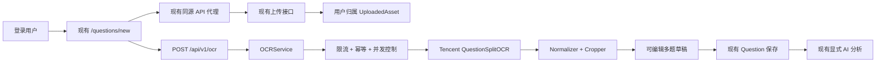

# 腾讯云 QuestionSplitOCR 增量接入设计规格

- 日期：2026-07-14
- 状态：用户已批准需求与规格，直接进入实现
- 基线：`codex/ai-exam-system` @ `0dd15f6`
- 实施分支：`codex/tencent-question-split-ocr`
- 范围：只扩展现有错题上传、OCR 草稿、保存及 AI 分析流程

## 1. 目标与边界

把现有“单张图片 → 单题 Demo/OpenAI OCR → 可编辑表单”扩展为：

> 上传 PNG/JPEG/BMP/PDF → 后端调用腾讯云 QuestionSplitOCR 一次 → 本地拆分多题 → 编辑题目草稿卡片 → 用户确认答案/解析 → 复用现有错题保存 → 复用现有 AI 分析

本次不重建项目、不新增重复 OCR 页面、不新增第二套上传接口，不改变现有错题字段含义，也不让 OCR 自动生成或确认正确答案。OpenAI/演示 AI 继续负责保存后的分析，腾讯云只负责试卷切题 OCR。

## 2. 已确认的架构决策

### 2.1 独立 OCR Provider

现有 `AIProvider` 继续只服务分析与建议。新增独立的 `OCRProvider`、`OCRProviderFactory` 和 `OCRService`：

- `mock`：确定性的多题演示结果，供默认测试和无额度演示使用，明确标记为演示。
- `tencent_question_split`：唯一生产 OCR，实现官方 `QuestionSplitOCR`。
- `PROVIDER_MODE` 继续控制现有 AI；`OCR_PROVIDER` 独立控制 OCR。
- 路由不初始化 SDK，也不包含腾讯云结果解析逻辑。

### 2.2 复用现有 API

- 保留 `POST /api/v1/uploads/questions`，扩展真实内容验证与格式支持。
- 保留 `POST /api/v1/ocr`，请求扩展为 `upload_id`、`pdf_page_number` 和可选 `idempotency_key`。
- 新增只读 `GET /api/v1/ocr/status`，只检查本地配置，绝不调用腾讯云。
- 保留 `POST /api/v1/questions` 和 `POST /api/v1/questions/{id}/analyze`。
- 浏览器仍只访问 Next.js 同源 `/api/v1/*` 代理。

### 2.3 最小持久化

新增一个 `ocr_tasks` 表，不新增 OCR 题目草稿表：

- 保存用户、源上传、SHA-256、页码、Provider、参数版本、状态、腾讯 RequestId、题数、规范化 JSON 和安全错误信息。
- 服务端幂等键由 `user_id + 文件 SHA-256 + 页码 + provider + 参数版本` 生成并唯一约束。
- 成功结果直接复用；同进程并发请求通过每键异步锁合并；多实例遇到处理中任务时返回明确的处理中错误。
- 每题的可编辑状态先保存在前端；用户载入现有表单并提交后才成为正式 `Question`。

`Question` 仅增加可选 `ocr_metadata` JSON，用于保存题号、题型、坐标、Figure/Table 受控资源引用和识别原文。现有 `image_path` 继续指向原始上传。分析路由从归属当前用户的资源读取必要图片并交给现有 AI Provider；不会把受保护 URL 假装成公网 URL。

## 3. 腾讯云调用固定参数

后端使用腾讯云官方 Python SDK，固定调用：

- Endpoint：`ocr.tencentcloudapi.com`
- Action：`QuestionSplitOCR`
- Version：`2018-11-19`
- `ImageBase64`：唯一图像输入，不发送 `ImageUrl`
- `IsPdf`：按真实文件类型设置
- `PdfPageNumber`：PDF 默认 1；图片不发送有意义的页码
- `EnableImageCrop=true`
- `EnableOnlyDetectBorder=false`
- `UseNewModel=false`
- 请求超时默认 30 秒

SDK 客户端按应用复用；同步网络调用通过线程池执行。全局 Semaphore 默认 2，获取许可有界等待。最多重试 2 次，只重试临时网络、超时、内部错误和服务端错误，采用指数退避与少量随机抖动。

## 4. 配置与秘密

新增后端变量：

- `OCR_PROVIDER=mock|tencent_question_split`
- `TENCENTCLOUD_SECRET_ID`
- `TENCENTCLOUD_SECRET_KEY`
- `TENCENTCLOUD_REGION`，允许为空
- `TENCENTCLOUD_OCR_TIMEOUT_SECONDS=30`
- `TENCENTCLOUD_OCR_MAX_CONCURRENCY=2`
- `TENCENTCLOUD_OCR_QUEUE_TIMEOUT_SECONDS=5`
- `TENCENTCLOUD_OCR_MAX_RETRIES=2`
- `OCR_RATE_LIMIT_PER_MINUTE=5`
- `OCR_RATE_LIMIT_PER_HOUR=50`

真实值只放在被 Git 忽略的仓库根 `.env` 或部署平台后端变量中。缺少密钥不得阻止应用启动；仅在选择腾讯 Provider 并调用 OCR 时返回 `OCR_NOT_CONFIGURED`。状态接口不暴露缺少的是哪一项，不返回路径、密钥或 SDK 内部信息。

## 5. 上传、验证与质量提示

现有上传服务扩展为只接受真实 PNG、JPEG、BMP、PDF，并明确拒绝 WEBP、GIF、SVG、HEIC、TIFF、压缩包、HTML、脚本和可执行文件。

- 空文件、空文件名、伪装文件、损坏图片或 PDF 均在后端拒绝。
- 图片用 Pillow 完整解码并检查真实格式、宽高和像素上限。
- PDF 检查 `%PDF-` 文件头，并用 `pypdf` 验证可解析页数。
- OCR 前实际执行 Base64 编码，编码后字节数不得超过 10 MiB。
- 图片低于建议的 600×800、疑似模糊、过暗或过曝只产生 warning，不直接拒绝。
- 原始文件继续用 UUID 文件名和现有用户归属模型保存；不把用户文件名拼入路径。

## 6. 规范化结果

统一响应采用项目现有 snake_case：

```json
{
  "provider": "tencent_question_split",
  "api_name": "QuestionSplitOCR",
  "request_id": "request-id",
  "page_number": 1,
  "question_count": 2,
  "source": {
    "file_id": "upload-id",
    "original_width": 1600,
    "original_height": 2200,
    "processed_width": 1580,
    "processed_height": 2180,
    "angle": -0.2,
    "image_url": "/uploads/upload-id"
  },
  "warnings": [],
  "questions": []
}
```

每道题包含 `temporary_id`、顺序、可空题号、题型、题干、完整原文、题干元素坐标、选项、Figure、Table、题目裁剪、识别答案、识别解析、整题坐标、腾讯原始组类型和 warning。

规范化规则：

- Question/Option 元素按 `Index` 排序；原文不纠正数字、公式、单位或标点。
- 题号兼容 `1.`、`1、`、`1．`、`1）`、`（1）`、`第1题`、前导零和三位数；识别失败保持 `null`。
- 选项兼容半角/全角字母、点号、顿号、冒号和括号；无法解析标签时按顺序临时标 A、B、C、D，原文仍保留。
- 题型只做腾讯组类型到中性类型的映射，不推断单选/多选或正确答案数量。
- `Answer` 只进入 `recognized_answer`；`Parse` 只进入 `recognized_parse`；都不会自动写入正式正确答案或 AI 解析。
- 不伪造置信度，不返回 SDK 对象，不返回或持久化腾讯 `ImageBase64`。

## 7. Figure、Table 与裁剪

腾讯返回的矫正图 Base64 只在内存中短暂解码，用于按坐标裁剪；随后立即丢弃。没有矫正图时，图片使用原图裁剪；PDF 不自行伪造页图。

- 坐标先规范化为四点多边形及包围盒，再安全夹取到图像边界。
- 越界会裁剪到安全范围并添加 warning；无有效面积时保留坐标和原图，不删除题目。
- 题目、Figure 和 Table 裁剪图使用现有 `UploadedAsset` 保存，返回用户受控 `/uploads/{id}` URL。
- 失败时清理本次新生成但未提交的裁剪文件，重试和幂等复用不会生成重复裁剪。
- 资料分析共享材料关系不明确时保留文字和图表，并提示人工确认。

## 8. 前端交互

只扩展 `/questions/new` 的现有图片识别模式：

1. 文件选择支持 `accept` 与移动端 `capture`；PDF 显示页码输入和文件摘要，图片显示本地预览。
2. 读取 `/ocr/status` 显示真实/演示/未配置状态，但不阻止手动录入。
3. 上传后手动开始识别；按钮禁用并显示“正在识别题目，请稍候”。
4. 成功后显示题数及独立的可编辑题目卡片，包含题干、题型、选项、原图/裁剪、Figure、Table、识别答案、识别解析与 warning。
5. 每题可保留/删除、编辑、查看图片，并载入现有错题表单。
6. 载入时不覆盖用户已手填的正确答案或解析。采用识别答案/解析必须由用户点击明确的“采用”动作。
7. 已有编辑内容时重新识别必须确认；取消后保留原编辑。
8. OCR 成功不自动调用 `/questions`，保存后仍由详情页显式触发现有 AI 分析。

第一版不新增批量正式保存、手工合并或拆题；这些是原系统未有的可选能力。多题通过卡片逐题载入和保存，未载入的 OCR 任务仍由幂等结果保存。

## 9. 错误、日志与成本保护

业务错误使用统一 `{code,message,field_errors,request_id}`，覆盖配置、格式、大小、图片/PDF、无题、服务未开通、资源包耗尽、欠费、计费、凭证、限流、超时和通用 Provider 异常。状态码遵循需求中的 401/413/422/429/502/503/504 语义。

日志只记录 `user_id`、provider、API 名、腾讯 RequestId、耗时、成功与否、题数、错误码、文件大小和 PDF 页码；不记录题目全文、图片、Base64、密钥、签名、绝对路径或完整 SDK 请求/响应。

只有登录用户可调用 OCR。每用户默认 5 次/分钟且 50 次/小时；应用级限流的多实例局限会在部署文档明确说明。默认测试全部注入 Mock SDK，不调用腾讯。真实冒烟测试必须显式设置 `RUN_TENCENT_QUESTION_SPLIT_OCR_E2E=1`，只调用一次并输出脱敏的 RequestId 与题数。

## 10. 数据流



## 11. 验证标准

- 后端以 Mock SDK 覆盖需求列出的 48 个行为。
- 前端覆盖需求列出的 18 个交互行为；不适用的可选批量/合并能力不伪造。
- 运行完整 pytest、前端 Vitest、ESLint、独立 TypeScript、生产 build、Alembic 升级/检查、应用启动和安全扫描。
- 用 Chrome 在桌面与窄屏完成图片、多题、PDF、重新识别确认、保存和 AI 分析闭环。
- 真实腾讯冒烟仅在显式开关和有效密钥下执行一次；失败时按真实状态报告，不用 Mock 冒充。
